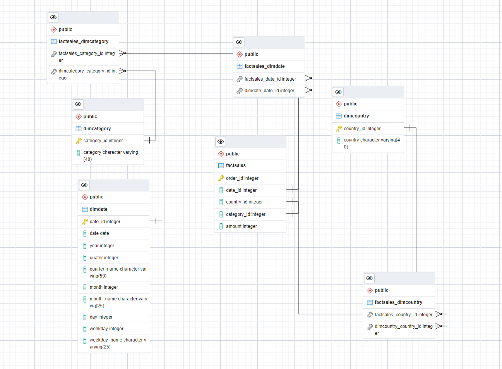

## Overview:
You are a data engineer hired by an ecommerce company named SoftCart.com . The company retails download only items like E-Books, Movies, Songs etc. The company has international presence and customers from all over the world. The company would like to create a data warehouse so that it can create reports like

- total sales per year per country
- total sales per month per category
- total sales per quarter per country
- total sales per category per country

You will use your data warehousing skills to design and implement a data warehouse for the company.

